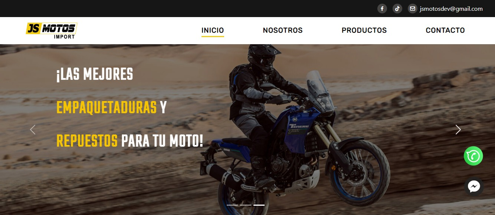
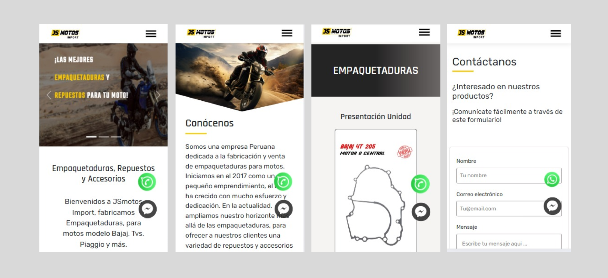

# JS Motos - Fabricación y Venta de Empaquetaduras para Moto

Bienvenido a JS Motos, un proyecto dedicado a la fabricación y venta de empaquetaduras para motocicletas en Perú. Este sitio web fue desarrollado con React y Bootstrap, ofreciendo una interfaz moderna y atractiva. Además, cuenta con funcionalidades como conexión directa a WhatsApp, Facebook Messenger y TikTok, junto con un formulario de contacto que dirige a Gmail.

## Características Destacadas

- **Diseño Moderno y Atractivo:** Desarrollado con React y Bootstrap para una interfaz visualmente agradable.
- **Conexión Directa a WhatsApp:** Facilita la comunicación directa con nuestros clientes.
- **Formulario de Contacto:** Permite a los usuarios ponerse en contacto con el Dueño a través de Gmail.
- **Totalmente Responsivo:** Garantiza una experiencia de usuario óptima en todos los dispositivos.
- **Gestión Integral del Hosting:** Nosotras, como parte de nuestro trabajo, también gestionamos todo sobre el hosting.

## Capturas de Pantalla

## URL del Sitio Web

[www.jsmotos.com](https://www.jsmotos.com)

## Colaboradoras

Este proyecto fue desarrollado en colaboración con un equipo comprometido. Agradecemos las contribuciones y el esfuerzo de cada miembro del equipo.

- [Sofia Torres](https://github.com/sofia-torres-v) 
- [Andre Navas](https://github.com/andrenavas) 
- [Pauli Vega](https://github.com/paulivega)

¡Gracias a todo el equipo por apoyo y dedicación!

